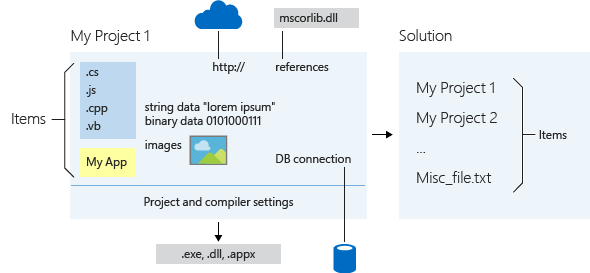

# 实验1. C++基础语法及类

## 一. 实验目的
1. 熟悉C++语言的基础语法；
2. 强化对C++类的认识，掌握构造函数、析构函数、缺省函数参数、参数引用、运算符重载等知识点；
3. 体会将C++的类作为用户自定义数据类型的思想；
4. 熟悉Visual Studio下进行C++程序开发环境和程序调试过程

## 二. 实验内容

| 实验内容             | 说明                                     |
| -------------------- | ---------------------------------------- |
| 实验1-1. **C++基础** | C++语法的基础练习。                      |
| 实验1-2. **有理数**  | 实现有理数类，能够执行有理数的基本运算。 |


## 三. 实验步骤和结果

### 实验1-1. 基础练习
#### 实验1-1a. 创建命令行应用程序(Win32 Console Application)

>  实验程序命名建议采用**`学号\_姓名\_实验编号`**的形式，例如：`2013112399\_小明\_1-1a.sln`。

**实验步骤**：

1. 用Visual C++创建一个空的命令行应用程序；
2. 在项目中添加cpp文件，并命名为`main.cpp`；
3. 在`main.cpp`文件中添加`main`函数，并在文件开头用`//`做注释，添加作者信息；
4. 编译文件，并运行程序。

**回答问题**：

1. 请说明使用的Visual C++版本。
2. 请对程序执行结果截图。
3. 请用程序示例说明C++语言注释`//`和C语言注释`/* */`的差异。
4. 请在Windows文件资源管理器中找到该项目目录，请截图说明；并从中找到`main.cpp`文件、`main.obj`和`学号-1-1a.exe`，亦请截图说明。
> 请注意，Windows默认隐藏了文件扩展名。可在“文件资源管理器”中设置显示文件扩展名。

**提示**：

* 文件`main.cpp`内容示例
  ```cpp
  // Ming XIAO, 2017/01/24, 软件设计综合实验1-1a
  #include <iostream>
  int main(int argc, char** argv) {
      std::cout << "Hello C++!" << std::endl;
      return 0;
  }
  ```

* VS201X的项目和解决方案，是将源代码(`*.cpp`和`*.h`文件)转化为可执行程序(`*.exe`)的一套机制
  * 一个**项目**(`*.vcxproj`文件)仅有一个输出(可执行程序`.exe`或库`.lib`)，但可包含多个源码文件(`.cpp`和`.h`)和其他资源。项目需记录文件路径、编译器信息等配置。
  * 一个**解决方案**(`*.sln`文件)包含至少一个项目，可认为是项目的容器。
  * 在VS201X界面中，*解决方案资源管理器*用于显示和设置项目内容。
    
  > VC6中，与`*.sln`和`*.vcxproj`相对应的是`*.dsw`和`*.dsp`文件。

_ _ _

#### 实验1-1b. C++输入输出

>  C++的标准库`std`中给出了输出函数`cout`和输入函数`cin`，可替代C语言的`printf`和`scanf`函数。相比之下，前者更简单方便，参考下例。
>
> ```c++
> char name[] = "Tom";
> int age = 10;
> printf("%s is %d.\n", name, age);      // C语言语法
> cout << name << " is " << age << endl; // C++语言语法，其中endl表示end of line
> ```

**实验说明**：

1. 请使用C++的`std::cin`和`std::cout`编写程序，实现如下功能：*输入姓名和数学英语成绩，显示姓名及总分*。程序的执行效果如下：
  ```shell
  > Please input name, math and english: Zhangshan 80 75 (回车)
  Student Zhangshan has total grade ：155
  ```

**回答问题**：

1. 请给出程序，并注释说明。
2. 要使用`std::cin`和`std::cout`，需引入哪个头文件?
3. 请说明`std::cout`中的`std`是何含义？在程序中，`std::cin`和`std::cout`是否可简写为`cout`和`cin`，需如何实现？
4. 若`std::cout`输出时，结尾处没有`std::endl`，将有何影响？

- - -

#### 实验1-1c. 引用(&)

>  C语言的**指针**强大而难用。C++引入了更安全的**引用**，其用法是：`类型 &引用名=变量名`。引用可视为某变量的一个*别名*；对引用操作与对变量本身操作效果一样。

**实验说明**：

* 请新建命令行应用，执行如下程序
    ```cpp
    int a = 5;  // 定义变量a并幅值
    int b = a;  // b是a的拷贝，即b是又一个int，其值与a相同
    int& c = a; // c是a的引用，因此c就是a，仅是称呼不同
    std::cout << "a:" << a << ",b:"<< b << ",c:" << c << std::endl;
    b += 7;
    std::cout << "a:" << a << ",b:"<< b << ",c:" << c << std::endl;
    c += 7;
    std::cout << "a:" << a << ",b:"<< b << ",c:" << c << std::endl;
    ```

**回答问题**：

1.  请给出执行结果，并分析修改变量`b`和`c`对变量`a`的影响？
2.  指针可能因**野指针**而导致错误。请用程序测试，能否出现“野引用“？
    ```cpp
    int* p; // 野指针
    int& c; // 野引用？
    ```

- - -

#### 实验1-1d. C++函数

>  C++函数的新特性包括：*函数名重载*、*缺省参数*、*参数引用*等

**实验说明**：

1. 请新建命令行应用程序，并输入以下程序以执行

   ```cpp
   void times(int a, int n) { a *= n; }
   void times(float a, int n) { a *= n; }
   void main() {
   	int x = 1;
   	times(x, 6);
   	std::cout << "x=" << x << std::endl;
   }
   ```

**回答问题**：

1. 解释在前文程序中`x`的值是否被更改为6？若要使`x`的更改为6，需利用*参数引用*对程序如何修改？

2. 通过单步调试，验证程序中两个`times`函数哪个被调用，并解释为什么？试解释C++允许函数重名有何好处？

3. 设置以上两个`times`函数的参数`n`的缺省值为2，如何修改程序和如何调用？

   > 带缺省参数的`times`函数调用形式为`times(x)`，可见，可省略第2个参数`n`，这时使用其缺省值。

**提示**：

- 在互联网检索“引用&”操作
- 使用键盘`F10`可单步执行，详细内容请查看“调试”菜单

_ _ _

#### 实验1-1e. C++动态内存

>  程序运行时，可能需*动态地申请内存空间*（所谓动态，指预先不知需多少内存空间）。C++提供了`new`和`delete`操作符代替C语言的`malloc`和`free`函数，前者用法更简单。其基本用法是：`类型* 指针=new 类型`和`delete 指针`。
>
> **注意**：`new`和`delete`必须**成对**，以防内存泄漏！

**实验说明**：

1. 执行以下程序。
    ```cpp
    // 示例1：申请一段int大小的内存
    int* x = new int; 
    // 示例2：申请一个点，包含x，y坐标
    struct Point { int x, y; };
    Point* p = new Point; // 申请一段Point大小的内存
    // 示例3：申请一段n个int大小的内存，其中n由键盘输入
    int n;
    std::cin >> n;
    int* xs = new int[n]; 
    // 注意：new和delete必须成对！
    delete x;          // 释放申请的内存
    delete p;          // 释放申请的内存
    delete[] xs;       // 批量释放申请的内存
    x = p = xs = NULL; // 将指针置为空
    ```


**回答问题**：

1. 符号`NULL`是什么含义？
2. 为什么在释放内存时，有时用`delete []`，有时用`delete`？两者分别在何种情况下使用？

**提示**：

- 框选`NULL`字符，点右键选择“转到定义”，以查看`NULL`的定义。

_ _ _

#### 实验1-1f. 工程中使用多个cpp/h文件
>  随着软件复杂度增高，工程中不可避免要用到*多个*`.cpp`和`.h`文件。此时需注意两个问题：
> 1. `.h`文件中只存放函数和类的**声明**，`.cpp`中放函数和类的**实现**；
> 2. `.h`文件中，需用宏`#pragma once`避免可能的重复引用。

**实验步骤**：

1. 新建命令行应用程序，添加文件`a.h`、`a.cpp`、`b.h`、和`b.cpp`
2. 在文件`a.h`中输入以下内容
    ```cpp
    class A {
    public:
        A();
    }
    ```
    在文件`a.cpp`中输入以下内容
    ```cpp
    #include "a.h"
    #include <iostream>
    A::A() {
        std::cout << "Hello!" << endl;
    }
    ```
3. 在文件`b.h`中输入以下内容
    ```cpp
    #include "a.h"
    ```
    在文件`b.cpp`中输入以下内容
    ```cpp
    #include "b.h"
    #include "a.h"
    int main(void) {
        A a;
        return 0;
    }
    ```
4. 编译程序

**回答问题**：

1. 程序编译是否出现错误，请截图说明。
2. 如何修改程序，可解决该错误。

**提示**：
* 在互联网检索“C/C++头文件的重复引用”

_ _ _

#### 实验1-1g. C++模板(可选)

> 参考`实验1-1d. C++函数`，尽管允许函数重名，但函数参数从`int`变为`float`时，仍需重新定义函数。若考虑更多参数类型，重定义函数将很繁琐。这种情况下，适合用**模板（template）**代替不同参数类型。
>
> 使用模板的示例如下：
>
>   ```cpp
>   // 定义
>   template <typename T> // template开头，表面模板函数；<typename T>说明T是待定数据类型
>   T square(const T& val) {return val*val;} // 在数据类型T的辅助下，给出统一的函数实现
>   // 使用
>   int a = square<int>(5);          // T 被替换为 int，a 的值是 25
>   double b = square<double>(5.0);  // T 被替换为 double，b 的值是 25.0
>   ```

**实验说明**：

1. 用模板(template)重新设计实验1-1d中的`times`

**回答问题**：

1. 给出用模板实现的`times`函数程序
2. 简要说明使用模板带来的好处

_ _ _


### 实验1-2. 有理数

#### 实验1-2a. 构造函数

>  *构造函数*是为了实现类成员变量的**自动初始化**，其主要任务即为对成员变量赋值，一般建议用初始化列表的形式，即 `类名称::类名称(参数):成员变量1(参数1),成员变量2(参数2) {;}`。

**实验内容**：

1. 请使用**初始化列表**的方式，实现`Rational`类的构造函数，给出完整程序

   ```cpp
   class Rational {
   public:
       Rational(int _fz=0, int _fm=1);    // 缺省构造函数
       Rational(const Rational& another); // 拷贝构造函数
       int fz/*分子*/, fm/*分母*/;
   };
   ```

2. 请完善如下测试，给出a和b中成员变量`x`和`y`的值

   ```cpp
   int main(void) {
       Rational a;
       Rational b = a;
       std::cout << "a:" << a.fz << ',' << a.fm << std::endl;
       std::cout << "b:" << b.fz << ',' << b.fm << std::endl;
   }
   ```

3. 简要分析构造函数的用途。

4. 能否将拷贝构造函数的参数`Rational& another`更改为`const Rational& another`？有何异同？

_ _ _

#### 实验1-2b. 析构函数

>  析构函数与构造函数相反，是类的实例在被释放时自动调用的函数，用于收尾工作。

**实验步骤**：

- 请执行如下程序

  ```cpp
  class Rational {
  public:
      ~Rational(void) {std::cout << "Quit." << std::endl;}
  };
  ```

**回答问题**：

1. 析构程序在何时被调用？
2. 简要分析析构函数的用途。
3. 对于类而言，析构函数是否是必须的？讨论在什么情况下必须定义析构函数？

**提示**：

* 考虑有动态内存申请的情况

    ```cpp
  class DynaMem {
     	unsigned int m_num; // 动态获取内存的数量
     	int* m_ptr;         // 指向所获取内存的指针
  public:
      // 构造函数。通过参数n，指定申请内存的数量。
      DynaMem(unsigned int n): m_num(n), m_ptr(new int[n]) {;}
      // 析构函数。指针不为空，则需释放内存。
      ~DynaMen() {if (m_ptr != NULL) delete [] m_ptr;}
  };
  ```

_ _ _

#### 实验1-2c. 综合练习

> 有理数是一个整数$a$和一个非零整数$b$的比，即$a / b$。有理数的运算结果仍为两个数之比的形式。例如：$\frac{1}{3} + \frac{1}{2}=\frac{5}{6}$。本实验需设计有理数类`Rational`，使其具备初始化、显示和赋值的功能，并能自动约分。
>
>  需注意：类的operator运算符仍然是成员函数，仅是函数名受限，必须为`operator 运算符`。

**需求说明**：

1. 用C++类实现有理数(Rational)，实现如下功能
    | 功能         | 举例                                           |
    | ------------ | ---------------------------------------------- |
    | 初始化       | `Rational a(2, 3), b = a; // a = 2/3, b = 2/3` |
    | 约分         | `Rational a(3, 9); // a = 1/3`                 |
    | 显示         | `Rational a(2, 3); a.print();`// 输出2/3       |
    | 赋值         | `Rational a(2, 3), b; b = a;`                  |
    | 加法（可选） | `Rational a(2, 3), b(4, 5), c; c = a + b;`     |
    | 乘法（可选） | `Rational a(2, 3), b(4, 5), c; c = a * b;`     |

2. 程序实现**不限于以上功能**，鼓励扩展。

**回答问题**：

1. 请对自己的程序进行客观评价，指出程序的**特色**和**不足**，以及有何**扩展**？
2. 请给出约分功能的程序实现，并适当注释说明。
3. 在实现显示功能的基础上，请针对*初始化*、*约分*和*赋值*功能，分别设计至少3组测试用例，给出部分测试程序，并给出测试结果
   * 例如：有理数初始化测试用例
   |       | 参数1 | 参数2 | 显示结果 | 正确 |
   | ----- | ----- | ----- | -------- | ---- |
   | 第1组 | 2     | 3     | 2/3      | 是   |
4. （可选）请给出有理数加法的程序实现，含适当注释说明，以及运算效果截图。
5. （可选）请给出有理数乘法的程序实现，含适当注释说明，以及运算效果截图。

**提示**：
* 有理数类`Rational`的最基本定义：
  ```cpp
  class Rational {
  public:
      // 初始化
      Rational(int _fz = 0, int _fm = 1); // 给定分子分母初始化
      Rational(const Rational& another);  // 由另一个有理数初始化
      
      // 加减乘除运算符重载 （可选）
      Rational operator +(Rational x);
      Rational operator *(Rational x);
  
      // 赋值运算
      void operator =(Rational x); // 用法：b = a;
  
      // 输出
      void print() const;
      
      // 功能可扩增.....
  
      // 约分
      void reduce(); // 例如 4/6 => 2/3
  
      int fz;    // 分子
      int fm;    // 分母
  };
  ```
  * 请参考此接口实现功能。并建议以此为基础，进行改进。

* 特别注意：
  * 分母为零情况的特殊处理
  * 通过求分子分母的最大公约数来约分

- - -

### 附录
##### 附录1-1 名词解释

* 文中专用名词及其解释
| 名词                        | 解释                           |
| ------------------------- | ---------------------------- |
| VC6                       | Visual C++ 6.0               |
| VS201X                    | Visual Studio 2010/2013/2015 |
| Win32 Console Application | 命令行应用程序                      |
| Solution                  | 解决方案                         |
| Project                   | 项目                           |

*version 0.0.6*

