# 实验3. MFC入门

### 一. 实验目的

1. 熟悉Visual Studio下进行C++程序开发环境和程序调试过程。
2. 熟悉MFC程序结构，包括框架、消息传递、定时器等。
3. 熟悉图形界面程序设计基本方法。
4. 熟悉MFC中的绘图功能。


### 二. 实验内容

|实验内容            |说明                   |
|-------------------|----------------------|
|实验3-1. **基础练习**|若干MFC基础知识的入门练习|
|实验3-2. **计算器**  |实现基于MFC的图形化计算器|
|实验3-3. **模拟时钟**|实现基于MFC的图形化模拟时钟|

### 三. 实验步骤和结果

#### 实验3-1. MFC基础

##### 实验3-1a. 创建MFC应用

**实验步骤**：

1. 使用MFC向导，分别创建SDI和Dialog应用。

**实验结果**：

1. 给出创建过程每个步骤的截图，并用文字说明各步骤的功用。

  > 参见附录3-1
2. 分别创建基于对话框(Dialog)和单文档(SDI)应用，查看在缺省状态下，向导分别创建了哪些类？并逐个说明各类的功能。

---

##### 实验3-1b. 控件

**实验步骤**：

1. 新建基于对话框(Dialog)的工程；
2. 在对话框中添加文本框(Edit Control)和按钮(Button)控件；

  <p></p>
3. 给文本框关联成员变量；

  * 右键点击并选择`Add Variable...`； 
4. 给按钮关联事件响应函数。
    ```cpp
    void CMFCApplicationDlg::OnBnClickedButton1() {
        TRACE(_T("Clicked。"));
    }
    ```
    > 参见附录3-2
    > 
    > 注意：`TRACE`宏对于VC下程序调试很有用，有着类似printf的功能。该宏仅出现在DEBUG版本中。建议在MSDN中检索TRACE Macro。此外，Unicode编码(VS201x的默认编码)下的TRACE输出中文可能有些问题，建议输出英文。


**实验结果**：

1. 给出程序运行的截图，并用文字说明。
2. 将程序从Debug版本修改为Release版本，再次编译运行，分析两种模式下运行效果的区别。
  <p>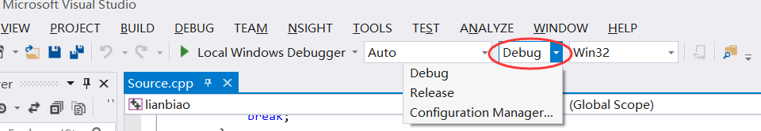</p>

  > 通过Visual Studio的菜单栏上的下拉菜单，可设置程序编译输出结果为Debug版本或Release版本。

---

##### 实验3-1c. 对话框

**实验步骤**：

1. 给前文CButton的事件处理程序中添加代码
    ```cpp
    MessageBox(_T("Hello 小明/*此处替换为你的名字*/!"));
    ```

    > 注意VS201X中，字符串需结合宏`_T`使用。`_T`在ANSI编译模式下表示ANSI串，在UNICODE下表示UNICODE串。

**实验结果**：

1. 给出程序执行的截图。

**提示**：

* MessageBox的常见用法
    ```cpp
    MessageBox(_T("这是一个最简单的消息框！"));
    MessageBox(_T("这是一个有标题的消息框！"), _T("标题"));
    MessageBox(_T("这是一个确定取消的消息框！"), _T("标题"), MB_OKCANCEL);
    MessageBox(_T("这是一个警告的消息框！"), _T("标题"), MB_ICONEXCLAMATION);
    ```
---

##### 实验3-1d. 定时器

* MFC定义了定时器类`CTimer`，可定时触发事件响应函数，常用于周期性地状态更新。

**需求说明**：

1. 在基于对话框的MFC应用中，添加定时器，使程序在执行时每1秒钟能够用`TRACE`输出一条消息。

**实验结果**:

1. 给出程序执行时`TRACE`动态输出消息的截图。 
2. 总结`SetTimer`、`OnTimer`和`KillTimer`函数的用法。

**提示**：

* 首先，在向导自动生成的代码中找到`CDialog`的初始化函数`OnInitDialog`，在其中使用`SetTimer()`函数，以创建定时器。
    ```cpp
    BOOL CMFCApplicationDlg::OnInitDialog() {
        ...
        // 在此添加额外的初始化代码
        SetTimer(1, 100, NULL); // 参数1：定时器标记，参数2：间隔时间
        ...
    }
    ```
  > 注意：一般将代码添加到函数末尾处，此处通常有`// 在此添加额外的初始化代码`的提示。

* 其次，通过类向导(Class Wizard)添加`OnTimer(nIDEvent)`消息处理函数。
  <p>&nbsp &nbsp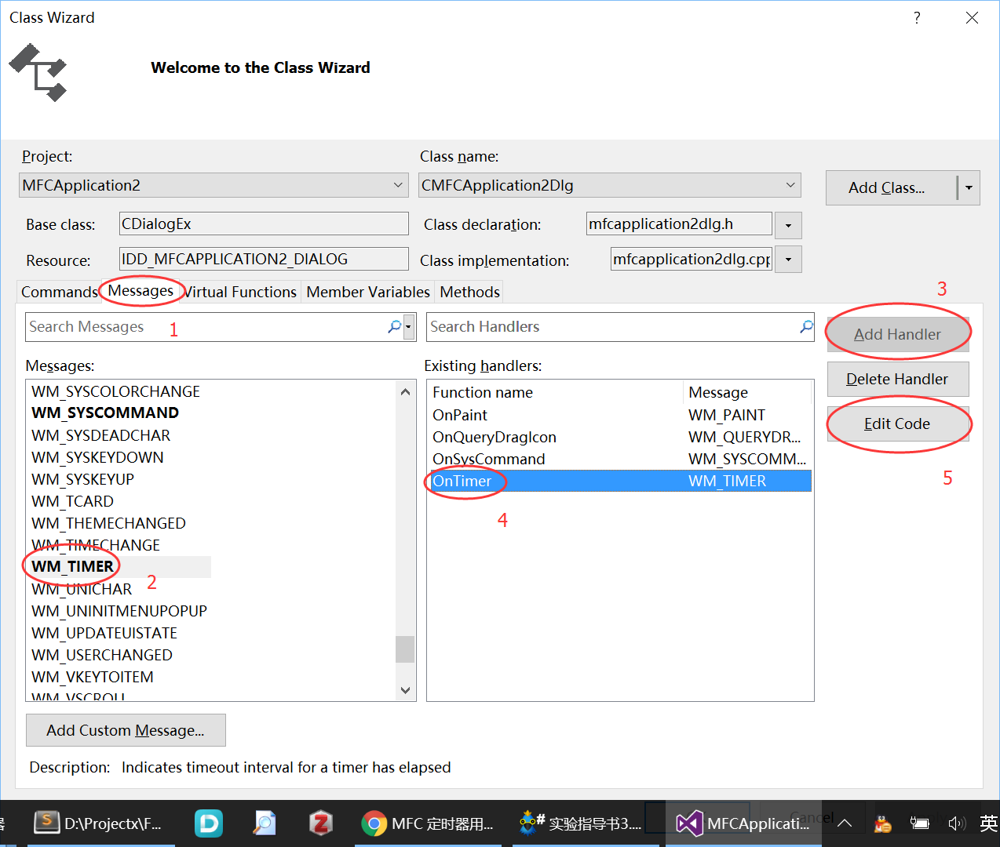</p>

  该函数中的代码将在定时器被触发时自动运行。

    ```cpp
    void CMFCApplicationDlg::OnTimer(UINT_PTR nIDEvent) {
        // TODO: Add your message handler code here and/or call default
        CDialogEx::OnTimer(nIDEvent);
        TRACE(_T("Timer triggered\n"));
    }
    ```
  如果程序中有多个定时器，则共用一个`OnTimer`消息处理程序，并通过判断定时器标志`nIDEvent`来区分不同的定时器。

* 最后，当不需要计时器的时候调用`KillTimer(nIDEvent)`。

---


##### 实验3-1e. 绘图

**需求说明**：

* 在单文档应用中绘制椭圆、矩形等图形；

**实验步骤**：

1. 建立单文档(SDI)软件，通过修改菜单实现绘图菜单的建立与响应函数；
2. 建立上下文设备，建立相应的画笔(Pen)、画刷(Brush)和颜色结构体；
3. 用画笔绘制点、直线（可选：折线、曲线、图等）；
4. 用画刷绘制椭圆、矩形（可选：角矩形、弦、饼、多边形等）；

**实验结果**：

1. 给出菜单控制和绘制图形结果的截图
2. 请指出程序刷新(例如缩放)后图形能否保持。

  > 参见附录3-3

---

#### 实验3-2. 计算器

**需求说明**：
1. 设计基于MFC的计算器，实现计算器的界面（参考下图）和基本功能
	* 包括：加、减、乘、除，只需实现二元表达式运算的简单功能。
2. 对于学有余力的同学，可参考Windows自带计算器，完善程序功能。
<center>

</center>

**实验步骤**：
1. 实现计算器的界面。
2. 实现计算器界面按钮的功能，包括：加、减、乘、除和等号按钮。

**回答问题**：

1. 给出计算器界面和至少三种运算的实现结果的效果截图。
2. 请给出**核心**代码，并适当注释和添加说明。

---

#### 实验3-3. 模拟时钟

**需求说明**：

1. 实现模拟时钟的动态显示，时钟应至少应包括：时针、分针、秒针、表盘。表针根据当前系统时间动态变化。
<center>

</center>


2. 具有闹钟功能，用户可预设1个或多个闹钟。闹钟包括时间及对应的提醒事项。当运行到闹钟时间后，可通过界面或声音提醒用户，并显示提醒事项。如果用户不点击，则持续提醒。
3. （可选）可以切换显示方式（模拟表针、模拟LED数显之间切换）
4. （可选）可最小化到系统托盘，或可作为屏幕保护程序。

**实验步骤**：

1. 新建MFC的单文档程序
2. 在MFC的`CView`派生类中定义并启动`Timer`，在`OnTimer`函数中以实现当前系统时间的定时更新、闹钟事件的检查与触发；
3. 在MFC的`CView`派生类中修改`OnDraw`函数，实现时钟背景、表针的绘制；
4. 设计、编写闹钟事件管理类，可对闹钟事件进行编辑、保存、读取。

**实验结果**：

1. 分别给出模拟时钟正常运行、触发闹钟时的截图。
2. 请给出**核心**代码，并适当注释和添加说明。

**提示**：

* 获取系统时间：时间类`CTime`
    ```cpp
    CTime CurTime = CTime::GetCurrentTime(); 
    // Find the hour, the minute, and the second values of the time 
    int ValHours = CurTime.GetHour(); 
    int ValMinutes = CurTime.GetMinute(); 
    int ValSeconds = CurTime.GetSecond();
    ```

---


### 附录
##### 附件3-1 VS2013下创建MFC工程

**使用MFC应用向导(MFC Application Wizard)**

* 打开VS2013(VS201X界面类似)，在菜单中选择：`File`$\to$`New`$\to$`Project`。
<p>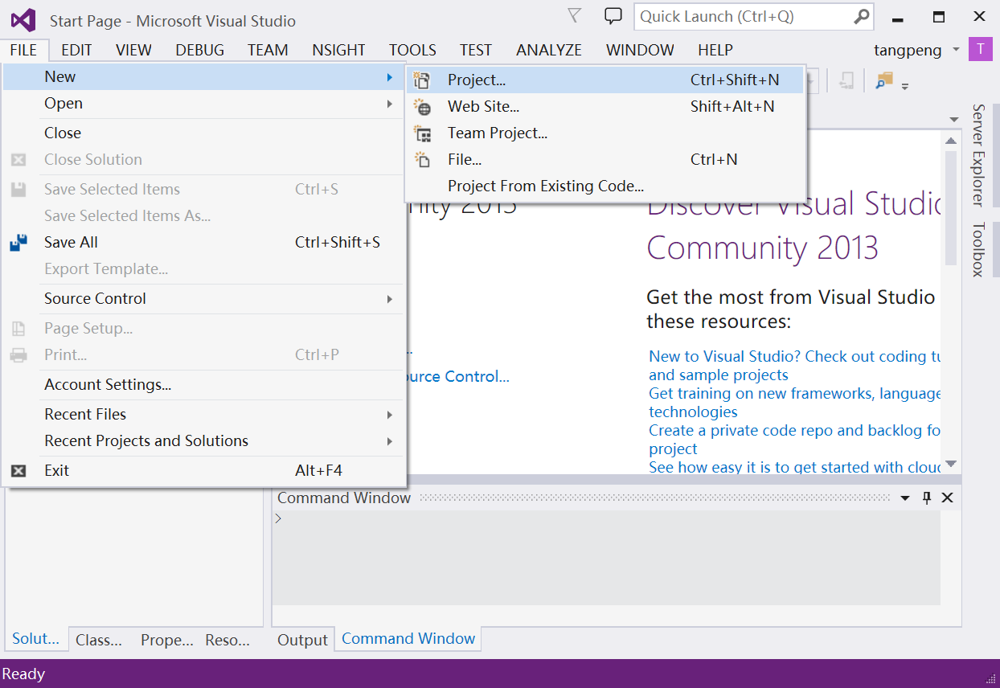</p>

* 选择`MFC Application`，并适当命名，然后点`OK`。
<p></p>
<p></p>

* 在`Application type`选项卡中选择类型，建议`Project style`选择`MFC standard`，然后点击`Finish`以结束向导，或者点`Next`以进一步设置。
<p></p>

* 点击`Local Windows Debugger`(绿色小三角图标)，以编译并运行程序。
<p></p>

* 运行效果。
<p></p>

##### 附录3-2 添加按钮

**使用资源视图(Resource View)**

* 首先新建基于对话框的MFC应用，然后需打开`Resource View`(资源视图)，找到对话框以添加控件。打开资源视图的步骤是：选择菜单`View`$$$\to$$$`Resource View`(各版本VS稍有不同)。
<p>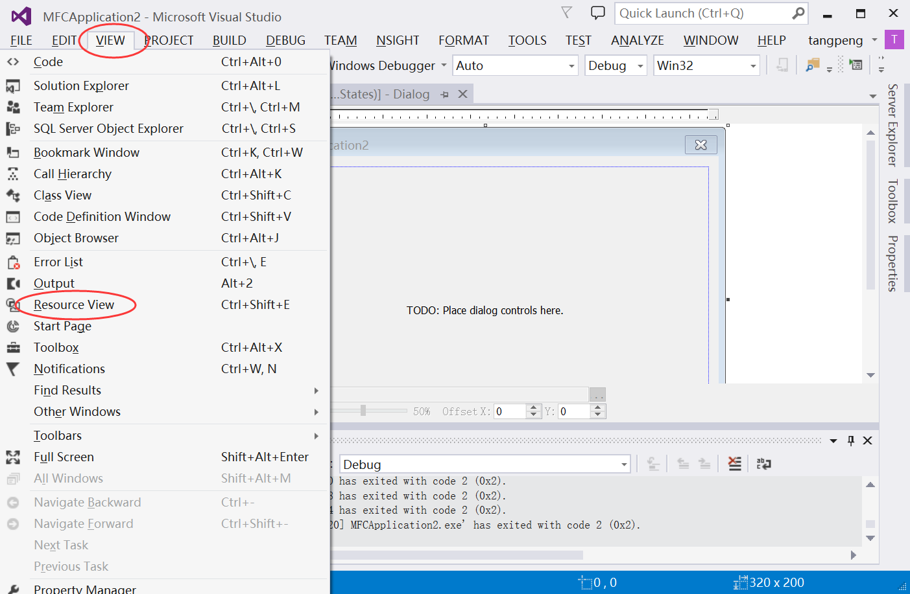</p>

* 在资源视图中，找到`Dialog`下的`IDD_MFCAPPLICATION_DIALOG`(名字可能稍有不同)，然后双击，以打开对话框界面。
<p>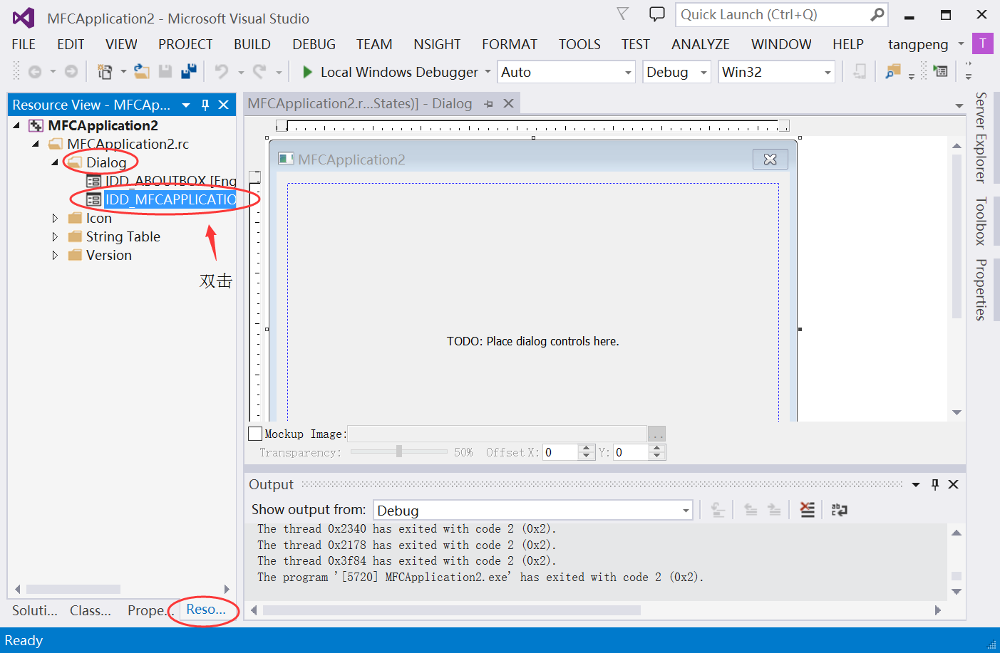</p>

* 在界面中添加`Toolbox`(控件工具栏)，以便于添加控件。
<p>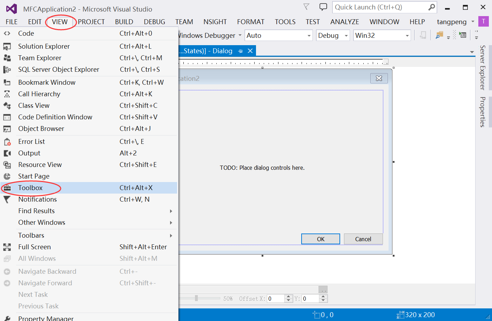</p>

**添加按钮(Button)**

* 从`Toolbox`中拖拽`Button`到对话框。
<p></p>

* 在按钮上点右键，选择`Add Event Handler`。
<p></p>

* 设置响应函数的名称，并选`Add and Edit`。
<p>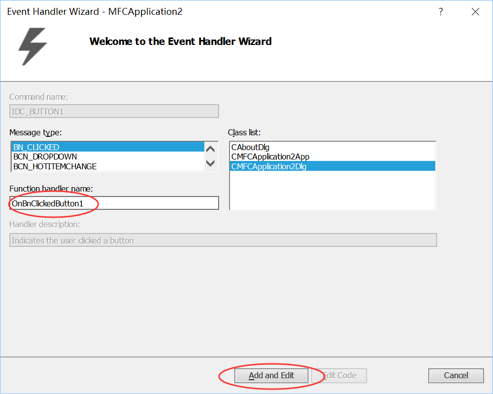</p>

* 在出现的函数中，添加代码。请注意，该函数名即为前一步所设置的函数名。
<p></p>

* 编译运行，可看到`TRACE`输出结果到`output`窗口中。
<p></p>

**添加文本框(Edit Control)**

> 拖动文本框控件即可添加文本框。

* 获取或设置文本框的内容
    ```cpp
    CEdit* e = (CEdit*)GetDlgItem(IDC_EDIT1);  // 获取文本框的指针
    CString s;
    e->GetWindowTextW(s); // 获取文本内容
    e->SetWindowTextW(s +_T("OK")); // 设置文本内容
    ```

  > 实际中，文本框的内容常与某变量相关联（例如：在文本框输入成绩，即对应一个0~100的整数），因此VC++提供了关联文本框和成员变量的机制，用向导即可实现。

* 添加`Edit Control`控件，并用右键选择`Add Variable`.
<p>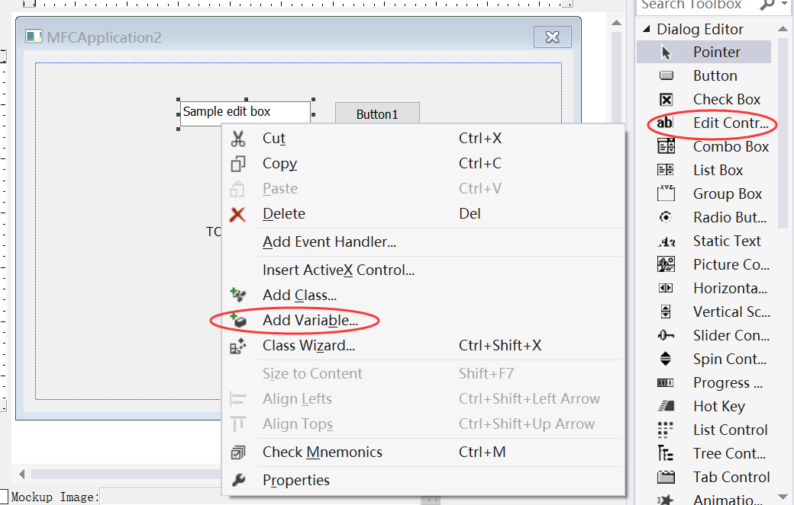</p>

* 适当修改成员变量的参数。注意先修改`Catelog`为`value`，然后才能修改其他参数。
<p></p>

* 点击`Class view`页面，可以看到`CMFCApplication2Dlg`类(你的类名很可能不同，但都以Dlg结尾)之中有`m_score`成员变量。
<p>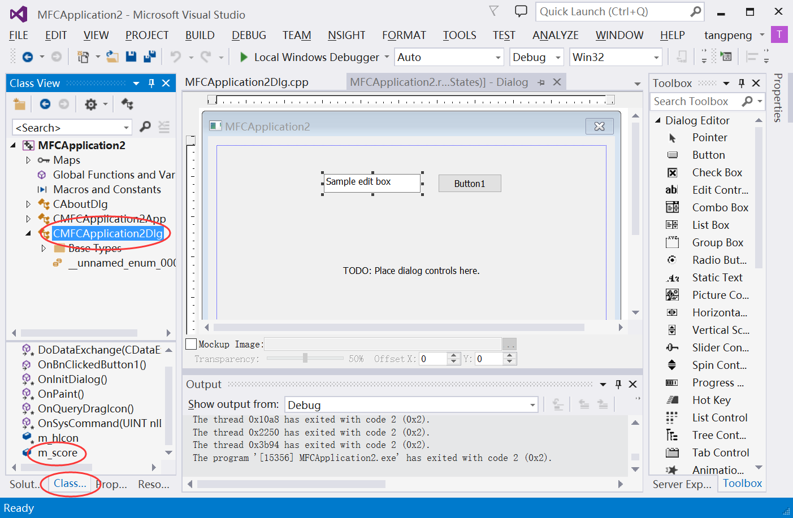</p>

* 修改按钮的响应函数
<p></p>

##### 附录3-3 绘图

**画基本图形**

>  绘图功能通过重载成员函数实现。但需注意，在单文档(SDI)应用中，亦或对话框应用中，绘图需重载的成员函数是不一样的。

* SDI应用中，重载`CView::OnDraw(CDC* pDC)`函数实现绘图，其中函数参数给出了CDC指针。
    ```cpp
    void CMyAppView::OnDraw(CDC* pDC) {
        CMyAppDoc* pDoc = GetDocument();
        ASSERT_VALID(pDoc);
        // TODO: add draw code for native data here
        ...
    }
    ```
  > 注意，该函数的缺省形式是`void CMyAppView::OnDraw(CDC* \*pDC*\)`，即参数`pDC`被注释掉了。去掉注释符即可。

* 对话框应用中，重载`CDialog::OnPaint()`函数实现绘图，并且需用编写代码来获取CDC指针。
    ```cpp
    CDC *pDC;
    pDC = GetDC();
    ```
  > 在此约定，后文示例中的`pDC`变量皆为有效的`CDC`类型指针。

* 在绘图函数之外，在适当的时候(例如某按钮的事件响应函数)，强制更新窗口，重新绘制
    ```cpp
    Invalidate(FALSE);
    UpdateWindow();
    ```

**创建画笔和画刷**
* 创建画笔
    ```cpp
    ...
    CPen *pNewPen = new CPen, *pOldPen = NULL;
    if (pNewPen->CreatePen(PS_DASH, 4, RGB(255, 0, 0))) {
        pOldPen=pDC->SelectObject(pNewPen); // 选新笔并返回旧笔
        ...(绘图)...
        pDC->SelectObject(pOldPen);
    } else {
        AfxMessageBox(_T("CreatePen Error!"));
    }
    delete pNewPen;
    ...
    ```

* 创建画刷
    ```cpp
    CBrush *pNewBrush = new CBrush, *pOldBrush = NULL;
    if (pNewBrush->CreateSolidBrush(RGB(255, 0, 0))) {
        pOldBrush=pDC->SelectObject(pNewBrush);
        ...(绘图)...
        pDC->SelectObject(pOldBrush);
    }
    delete pNewBrush;
    ```

**画基本图形**

> 特别注意：绘图坐标系的y轴方向是向下的。
>
> <p>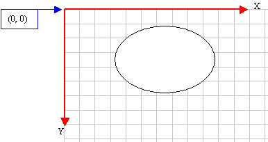 </p>

* 画点
    ```cpp
    pDC->SetPixel(100, 20, RGB(255,0,0))
    ```

* 画直线
    ```cpp
    pDC->MoveTo(20, 60); // 移动到直线的起点
    pDC->LineTo(160, 80); // 画到终点
    ```

* 画折线
    ```cpp
    POINT polyline[4]={{20,190}, {70,190}, {20,240}, {70,240}};
    POINT polypolyline[9]={{95,160}, {120,185}, {120,250}, {145,160}, {120,185}, {90,185}, {150,185}, {80,210}, {160,210}};
    DWORD dwpolypoints[4]={3,2,2,2};
    // 画折线和若干折线
    pDC->Polyline(polyline, 4);
    pDC->PolyPolyline(polypolyline, dwpolypoints, 4);
    ```

* 画Beizer曲线
    ```cpp
    POINT polyBezier[4]={{20,310},{70,250},{110,290},{160,330}};
    pDC->PolyBezier(polyBezier, 4);
    ```

* 画椭圆
    ```cpp
    pDC->Ellipse(20, 20, 226, 144);
    ```
<p>&nbsp &nbsp </p>

`BOOL Ellipse(int x1, int y1, int x2, int y2);`

* 画矩形
    ```cpp
    pDC->Rectangle(190, 270, 250, 310);
    ```

* 画圆角矩形
    ```cpp
    pDC->RoundRect(260, 270, 330, 310, 30, 20);
    ```
<p>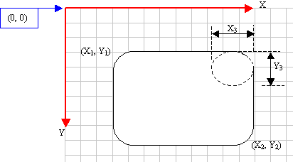&nbsp &nbsp</p>

`BOOL RoundRect(int x1, int y1, int x2, int y2, int x3, int y3);`

* 画多边形
    ```cpp
    POINT polygon[3]={{400,160}, {430,220}, {350,210}};
    POINT polypolygon[6]={{450,120}, {540,320}, {480,280}, {400,300}, {540,320}, {480,280}};
    int polygonpoints[2]={3, 3};
    pDC->Polygon(polygon, 3);
    pDC->PolyPolygon(polypolygon, polygonpoints, 2);
    ```

* 输出文字
    ```cpp
    pDC->TextOut(20, 20, _T("point"));
    ```

##### 附录3-4 名词解释

* 本文中的专用名词
|名词|解释|
|----|----|
|MFC|Microsoft Foundation Classes|
|MSDN|Microsoft Developer Network|