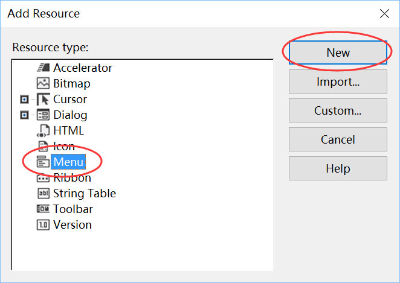
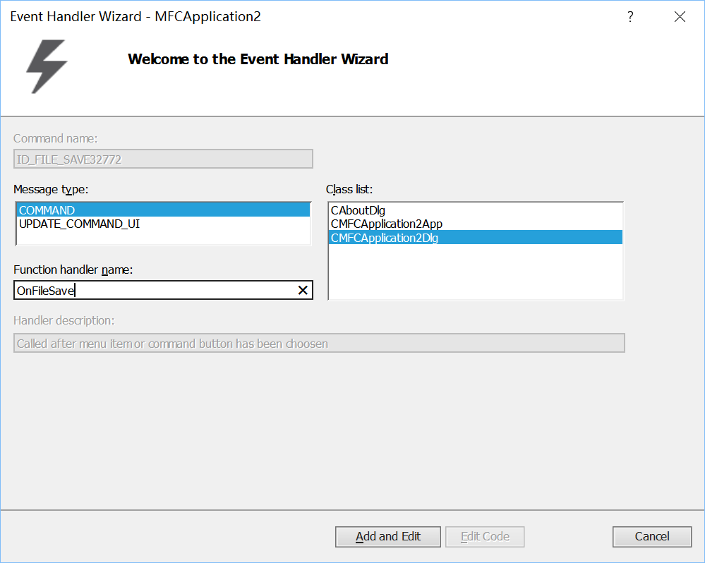

# 实验4. MFC综合应用

### 一 实验目的

1. 强化C++语言的基础语法；
2. 强化对C++类的关键知识点的认识，深刻体会将类作为用户自定义数据类型的思想；
3. 掌握MFC的绘图操作及定时器操作；
4. 了解游戏程序设计的基础过程
5. 继续熟悉Visual Studio下进行C++程序开发环境和程序调试过程

### 二 实验内容

|实验内容|说明|
|--|--|
|实验4-1. **基础练习**|若干MFC基础知识的入门练习。|
|实验4-2. **命令行贪吃蛇** |实现命令行模式下的贪吃蛇游戏。|
|实验4-3. **图形界面贪吃蛇** | 基于MFC的图形界面，可根据游戏需求扩展功能。|

**注意**：实验4-2和实验4-3两个实验，**选作其中一个**。

### 三. 实验步骤

>  本文中的示例以Microsoft Visual Studio 2015为准，其他版本的Visual Studio使用方式类似。 

#### 实验4-1 基础练习
##### 实验4-1a. 菜单

>  基于对话框（Dialog）的应用程序本没有菜单，但可以给其添加菜单。 

**实验步骤**：

1. 给Dialog添加菜单资源；
	* 打开资源视图：菜单`视图`>`其他窗口`>`资源视图`；
	* 在`工程名.rc`上点右键，选`添加资源...`；
	* 在对话框中选`menu`，然后点`新建`，以新建菜单。
2. 在菜单资源中添加`File`项，并在其弹出菜单中添加*Open*和*Save*；
3. 设置*Open*和*Save*菜单项的`popup`属性为false；
4. 通过设置对话框的`Menu`属性，将菜单添加至对话框；
5. 给菜单项添加事件处理程序。
  > 参见附录A1

**实验结果**：
1. 给出程序顺序执行的截图。
2. 结合实验截图，说明菜单项的`Popup`属性的意义。

##### 实验3-1b. 文件对话框
**实验步骤**：
1. 在前文的事件处理程序中添加代码
  在菜单项`Open`的事件处理函数中添加如下代码
    ```cpp
    CFileDialog file_dlg(true);
    file_dlg.DoModal();
    ```
  在菜单项`Save`的事件处理函数中添加如下代码
    ```cpp
    CFileDialog file_dlg(false);
    file_dlg.DoModal();
    ```

**实验结果**：
1. 给出程序顺序执行的截图。
2. 请结合程序说明，如何判断用户在文件对话框中是否点击了“取消”按钮？

**提示**：

* `CFileDialog`是MFC的文件对话框类。以下是其使用示例。
    ```cpp
    CFileDialog fileDlg (TRUE);
    fileDlg.DoModal() // 显示对话框，并等待用户
    if( fileDlg.DoModal ()==IDOK ) { // 返回 IDOK.
        CString m_strPathname = fileDlg.GetPathName(); // 文件路径
        // m_title.SetWindowText(m_strPathname);
    }
    ```

* `CFileDialog`的使用流程为：
	1. 创建`CFileDialog`的实例
	2. (可选)设置修改该实例的参数.
	3. 调用`CFileDialog`的`DoModal()`函数 
	4. 当DoModal函数返回, 调用`GetPathName()`函数，获取文件路径

* 其中，构造函数的第1个参数尤其重要。
	|构造函数第1个参数|调用DoModal函数|
	|-------|---------------|
	|TRUE|显示打开文件对话框|
	|FALSE|显示保存文件对话框|

_ _ _

#### 实验4-2 命令行贪吃蛇游戏

**需求说明**：
1. 实现命令行贪吃蛇游戏，游戏界面如下图
<p></p>

> 游戏控制：用键盘控制蛇头运动方向，含上下左右共四个方向；蛇尾能够遵循蛇头运动轨迹前进；
> 游戏逻辑：场景中随机生成食物；蛇头迟到食物后增加得分并尾巴长长；蛇头迟到蛇身为游戏失败。
> 游戏过程中实时显示游戏得分。

**实验步骤**：

1. 定义贪吃蛇游戏涉及的状态变量
2. 定义基于键盘控制的游戏输入函数。
3. 定义应用命令行字符输出的显示函数，其中需包含清除屏幕的操作。
4. 定义游戏逻辑的函数，以根据输入更新状态变量。
5. 在循环中调用游戏的输入、逻辑和绘图函数，实现游戏功能。

**回答问题**：
1. 请绘制出程序流程示意图。
2. 请给出至少4个程序执行的截图。
3. 请给出游戏逻辑控制部分的的代码，并适当注释和说明。
4. 请对自己的程序进行评价，指出其中优点和不足。

**提示**:

* 功能模块划分
  |模块|功能说明|
  |-|-|
  |键盘输入模块|接受键盘(或鼠标)消息<br>响应迅速|
  |游戏逻辑模块|根据输入，在游戏中产生相应的剧情|
  |显示模块|将游戏内容动态的绘制到显示器<br>快速绘制，避免闪烁|
  |主函数(main)|在循环中完成 输入 / 逻辑 / 显示<br>直到 用户手动退出 或 游戏结束|

* 程序框架
    ```cpp
    #include <iostream>
    #include <conio.h>
    #include <windows.h>
    // 函数声明
    namespace snakegame {
    void clearScreen(); // 清除屏幕中内容，以重新绘制
    void setup(); // 初始化
    void draw(); // 绘制每帧游戏画面
    void input(); // 接受键盘输入
    void logic(); // 根据输入和游戏状态，利用游戏逻辑对游戏状态进行更新
    ...
    }
    ...
    int main() {
        snakegame::setup();
        while (!snakegame::gameOver) {
            snakegame::draw();
            snakegame::input();
            snakegame::logic();
            Sleep(40);
        }
        system("pause");
        return 0;
    }
    ```

* **键盘输入模块**：按键`w`、`s`、`a`和`d`，以控制蛇头做上下左右的移动。需调用头文件`conio.h`，并使用其中的函数`int _kbhit(void)`和`int _getch(void)`。
    ```cpp
    #include <conio.h>
    void snakegame::input() {
        if (_kbhit()) {
            switch (_getch()) {
            case 'a':
                dir = LEFT;
                break;
            ...
            case 'x':
                gameOver = true;
                break;
            }
        }
    }
    ```
  > 其中的`LEFT`等是预先定义的常量，如：`enum eDirecton {STOP = 0, LEFT, RIGHT, UP, DOWN};`

* **绘制模块**：调用WindowsAPI，将光标复位以重新绘图。防止屏幕闪烁。
    ```cpp
    #include <windows.h>
    void snakegame::clearScreen() {
        HANDLE hOut = GetStdHandle(STD_OUTPUT_HANDLE);
        COORD Position = {0, 0};
        SetConsoleCursorPosition(hOut, Position);
    }
    void snakegame::draw() {
        clearScreen();
        //system("cls");
        ...
        // 请在此补充程序
    }
    ```

* **游戏逻辑模块**
    ```cpp
    // some global variables defined!
    void snakegame::logic() {
        // move the snake
        ... 请在此补充程序
        // update head position by key-input
        ... 请在此补充程序
        // if snake head touch border ?
        ... 请在此补充程序
        // if snake head eat its tail ?
        ... 请在此补充程序
    }
    ```

_ _ _

#### 实验4-3 图形界面贪吃蛇游戏

**需求说明**：
* 基于MFC的图形化界面贪吃蛇游戏
* (可选)可增加游戏保存和载入功能，增加游戏参数配置功能
* (可选)记录前10名最高得分结果

**实验步骤**：

1. 新建MFC的单文档程序
2. 新建定义贪吃蛇的类，移植实验9-1中的游戏输入和游戏逻辑功能
3. 在MFC的CView派生类中定义Timer以实现定时更新
4. 在MFC的CView派生类中重载OnDraw函数，实现图形界面绘制

**实验结果**：

1. 给出4组实验结果截图。若程序有创新或扩展，请在此说明。
2. 给出你认为的(部分)核心代码，并详细注释说明功能和思路。
3. 请回答本次实验的最难点是何处，是否解决，如何解决？
4. 和其他同学相比，自己的工作有何独特之处？并以实例(截图、部分程序等)证明。

---

### 附录

> 以下示例是基于VS2013截图，其他版本VS类似。

#### 附录4-1 基于Dialog的MFC应用窗口中添加菜单。

* 在资源视图下，右键点击`MFCApplication.rc`(名字可能略有不同)，选择`Add Resourse...`，以打开资源添加对话框。
<p></p>

* 选择`Menu`(菜单)，然后点击`New`。
<p></p>

* 资源视图中出现`Menu`项，其中含有`IDR_MENU1`(名字可能略有不同)。双击可打开菜单界面，在其中添加菜单项，如图所示。
<p></p>

* 修改菜单项的属性。
<p></p>

* 特别注意`Popup`属性。可选择不同值，以实验其作用。
<p></p>

* 将新建的菜单添加到对话框界面。需在对话框的属性栏中设置`Menu`值。
<p></p>
<p></p>

* 至此菜单已经添加成功。但仍需给菜单项添加响应函数，以在菜单被选择时实现特定功能。
<p></p>
<p></p>

* 在向导生成的函数中添加代码。以下为弹出保存文件对话框的示例。
  ```cpp
  void CMFCApplication2Dlg::OnFileSave() {
      // TODO: Add your command handler code here
      CFileDialog file(false);
      file.DoModal();
  }
  ```

* 编译运行，测试功能。
<p></p>

* 点击`Save`，弹出“另存为”对话框。
<p></p>
